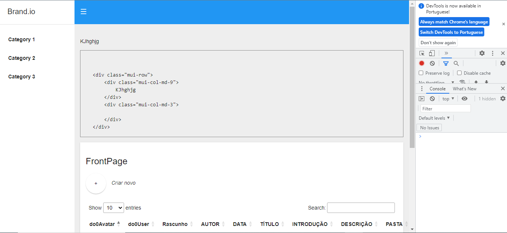

# GooglePrettyPrint

https://github.com/googlearchive/code-prettify

Implementando o Google Pretty Code 



```
<pre class="prettyprint">class Voila {
public:
  // Voila
  static const string VOILA = "Voila";

  // will not interfere with embedded <a href="#voila2">tags</a>.
}</pre>
```
